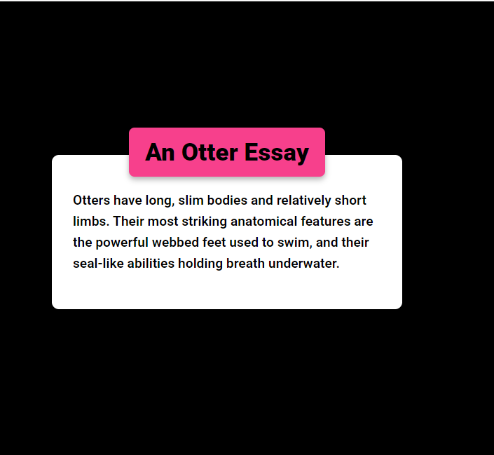

# AltSchool CSS Assignment 1

## Overview

This is an AltSchool CSS Assignment. The task focuses on mastering  layout design, CSS styling and responsive design in HTML and CSS.

## Features

- **CSS Styling:** Using Position in CSS to place your elements.
- **Responsive Design:** Built with Mobile-first responsive design.

## Installation

1. Clone the repository: ```javascript git clone https://github.com/Nkwor-Jane/otter_essay```

2. Navigate to the project directory: ```javascript cd otter_essay```

## Usage

1. Go to the **index.html** page.
2. Right click and select **Open with Live Server**.

## Screenshots

- Desktop View
  


## Live Demo

Check out the live demo [here](https://janeotteressay.netlify.app/).

## Contirbuting

Feel free to clone and fork this repository. You can also submit pull requests. Any contributions are welcome!

## Acknowledgements

- [AltSchool](https://learn.altschoolafrica.com/courses/) for organizing this challenge.
- Thank you to Oluwasetemi Ojo and the AltSchool mentors and managers for their contributions and guidance towards the successful completion of this assignment.

Feel free to customize it further to fit your needs! If you have any specific details you'd like to add or change, let me know.
